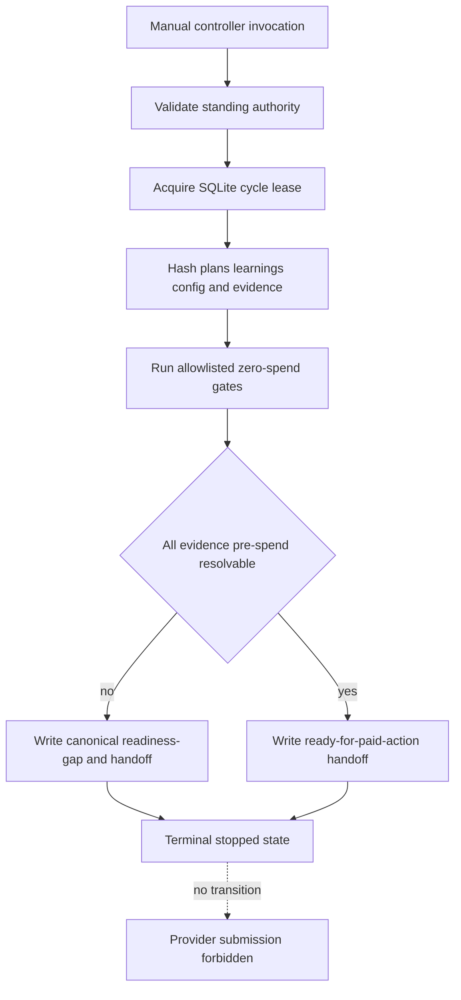
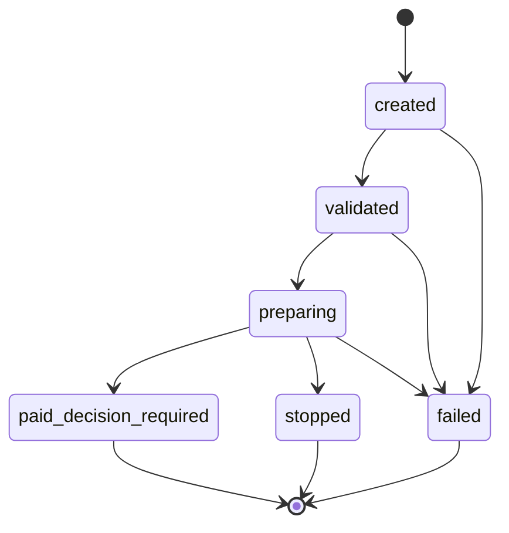

# Zero-Spend Readiness Controller - Plan

## Goal Capsule

- **Objective:** Make every safely achievable pre-spend decision deterministic and auditable, then stop with an exact handoff when the remaining evidence requires paid remote execution.
- **Means:** Add scope-bound standing-authority receipts, a stateful allowlisted controller, and one canonical pre-spend handoff artifact (KTD1-KTD7).
- **Authority:** The operator's standing authorization covers this plan's zero-spend implementation without per-hash pauses. It does not authorize U8, provider submission, weight movement, or nonzero reservation.
- **Execution profile:** Test-first, target-neutral tracked code, ignored local evidence, no provider execution primitive, and fail-closed state transitions.
- **Stop conditions:** Any nonzero requested or actual cost, weight movement, provider submission primitive, scheduling, secret, mount, volume, retry, destructive cleanup, private-data finding, unknown lineage, or fabricated resource evidence.
- **Tail ownership:** The Compound Engineering pipeline owns implementation, review, public-branch delivery, and CI. It stops before paid work.

---

## Product Contract

### Summary

Build a manually invoked research controller that performs all allowlisted zero-spend preparation through existing Python boundaries. It must persist its own lifecycle, authenticate the human standing authority independently, regenerate canonical local handoff evidence, and stop before any paid action. The final state must distinguish a lab that is mechanically ready from one that still needs empirical paid evidence.

### Problem Frame

The current preview correctly blocks on memory-fit evidence, cold-path timing evidence, and execution approval. Immutable metadata proves tensor bytes and configured context, but it does not prove runtime overhead, hybrid cache allocation, usable device memory, or remote transfer and execution time. The repository also intentionally contains no Modal submission primitive. Manual packet edits and prose authority cannot safely bridge those gaps.

### Key Decisions

- **Autonomous zero-spend preparation** (session-settled: user-directed — chosen over repeated per-hash approval pauses: bounded local work should continue until spending is the next boundary). Governs R1-R10.
- **Hard stop before Modal spend** (session-settled: user-directed — chosen over broad execution authority: no provider job, weight movement, or credit use is authorized). Governs R2, R5, R8-R10.

### Requirements

**Authority and lineage**

- R1. A closed local standing-authority receipt must bind an exact human statement digest, controlling plan, allowed zero-spend actions, forbidden actions, and expiry or explicit non-expiring scope. Repository hashing attests matching bytes; it does not authenticate human origin.
- R2. The validator must reject unknown fields, plan drift, action broadening, paid actions, and any provider SDK or remote-execution invocation primitive. The closed action allowlist, rather than the receipt's claimed origin, mechanically prevents self-broadening.
- R3. Formula approval must use a separate human-attested receipt that binds the reviewed and promoted formula digests rather than trusting an approval field supplied by the same local configuration. Paid execution remains blocked until a future authenticated execution approval exists.

**Controller lifecycle**

- R4. A manually invoked JSON CLI must expose only `status`, `prepare`, and `verify` operations implemented through named Python primitives.
- R5. The controller must have no scheduling, arbitrary shell, browser automation, provider SDK, submission, approval creation, weight transfer, or destructive-cleanup capability.
- R6. SQLite must persist controller-cycle identity, context hash, authority hash, state transitions, owner lease, selected action, stop reason, and output artifact hashes.
- R7. Concurrent or stale cycles must fail closed without publishing conflicting packets or reusing incomplete evidence.

**Evidence and handoff**

- R8. Preparation must regenerate one canonical pre-spend handoff from verified inputs; it must never invent missing memory or timing values.
- R9. The handoff must report exact config, challenge, execution-scope, reviewed-commit, control-plane, and readiness-packet hashes; the total ceiling from the validated ignored local ledger; `current_action_authorized_cap_usd: "0.00"`; `proposed_action_cap_usd: null`; and command and approval-wording availability. It must not manufacture paid authority while the exact action contract is absent.
- R10. The handoff must keep `262144 configured` separate from `262144 proven useful`, retain `u8_authorized:false`, and record requested and actual Modal cost as USD 0.

### Acceptance Examples

- AE1. **Covers R1-R3.** Given the exact human standing-authority artifact and formula approval lineage, validation succeeds; changing either statement, plan hash, action set, or artifact byte fails before controller mutation.
- AE2. **Covers R4-R7.** Given two controller processes for the same workspace, one obtains the lease and the other exits with a machine-readable contention stop without changing outputs.
- AE3. **Covers R6-R8.** Given an interrupted preparation cycle, reconciliation records a terminal failure and a rerun creates a new cycle rather than reusing partial artifacts.
- AE4. **Covers R8-R10.** Given verified metadata with unknown empirical resource components, preparation publishes explicit memory and timing gaps, preserves USD 0, and does not claim paid-action readiness.
- AE5. **Covers R5, R9-R10.** Given a final handoff, static inspection finds no Modal app or invocation primitive and the handoff names the exact separately authorized work needed before spending.

### Scope Boundaries

**In scope**

- Target-neutral authority, controller, database, packet, and validation code.
- Ignored local standing-authority, formula-approval, readiness-gap, controller-cycle, and handoff artifacts.
- Focused tests, runbook updates, publication checks, and durable learning.

**Deferred to Follow-Up Work**

- A separately approved paid-evidence amendment that resolves the memory and timing circularity without exceeding the validated ignored local total ledger.
- Any provider adapter, short-lived execution approval, reservation consumption, remote job, weight movement, reference evaluation, or cost settlement.

**Outside this plan**

- Promotion thresholds, candidate execution, useful-256K claims, scheduling, private inputs, retries, fallbacks, mounts, volumes, secrets, and destructive cleanup.

---

## Planning Contract

### Key Technical Decisions

- KTD1. Store the human standing authorization as an ignored closed receipt and freeze its statement digest in tracked code. Treat it as human-attested session evidence: hashing proves byte and scope identity, not human origin. The tracked action allowlist is the mechanical boundary, and no receipt can broaden it.
- KTD2. Add a separate human-attested formula-approval receipt that binds both the reviewed pre-promotion digest and the final approved formula digest. The formula verifier consumes this receipt instead of trusting `approval_status` alone, but no paid transition may rely on it as authenticated execution authority.
- KTD3. Implement the controller as a fixed operation dispatcher over existing library functions. Do not add a general command runner or provider adapter.
- KTD4. Persist controller cycles and leases in a narrow table beside the existing experiment lifecycle because controller preparation is not a model experiment and has different terminal semantics. Write immutable per-cycle handoffs first, then atomically commit their hashes with a lease-generation compare-and-set. Readers resolve canonical output only through that committed row; a stale owner can leave only an unreferenced file.
- KTD5. Model readiness as an enumerated result with satisfied gates and blockers. `paid_decision_required` is terminal and has no transition to submission. It does not claim that an executable paid action exists.
- KTD6. Treat metadata-derived facts as lower bounds or configuration facts unless a versioned method proves a conservative upper bound. Unknown empirical values remain named blockers.
- KTD7. Do not allocate a paid preflight from the current ledger in this plan. A later amendment must define whether preflight replaces U8, becomes part of U8, or receives a bounded allocation within the unchanged validated ignored local total.

### High-Level Technical Design





### Assumptions

- The existing ignored local phase and total ceiling remains unchanged; tracked artifacts do not publish its value.
- Provider concurrency authority remains `human_trust_override`, which is weaker than a cumulative provider dollar cap.
- No external source provides a guaranteed upper bound for remote transfer, load, and evaluation duration.
- A later paid-evidence plan must decide whether its work is U8 or a separately ledgered preflight; this plan cannot make that paid allocation decision.

### Risks and Dependencies

- Tracked changes invalidate the reviewed commit, control-plane hash, challenge, execution scope, and local packet. Regeneration must occur after the final reviewed commit.
- Formula authority promotion currently lacks independent human lineage. R3 must land before the formula gate is considered durable.
- A stale provider observation remains an accepted human-trust decision, not fresh mechanical proof.
- Controller output can become stale between verification and publication. KTD4 requires rechecking hashes under the lease.
- The current local reservation is designed for one reference execution. Spending part of it on a preflight without KTD7's later authority would invalidate the budget contract.
- The repository has no executable paid command by design and the controlling `PLAN.md` forbids adding one in this phase. A handoff must report `command_available:false`, `current_action_authorized_cap_usd:"0.00"`, and the exact future adapter/amendment requirement instead of inventing a command.
- Canonical handoffs omit timestamps. Time-bearing audit data remains in SQLite and is not part of the handoff identity.
- `status` and `verify` are read-only and never acquire a lease or create cycle rows. Only `prepare` creates a leased, persisted cycle and publishes an immutable artifact reference.

### System-Wide Impact

- The controller becomes the shared agent and operator entrypoint for zero-spend preparation, but it cannot perform human-only authentication, approval, or provider actions.
- New cycle rows are durable local audit data and must follow the same privacy, confinement, and bounded-output rules as experiment attempts.
- Every tracked change alters reviewed-commit and control-plane lineage, so ignored local evidence must be regenerated only after the public commit is final.
- The final readiness state enumerates satisfied and unresolved gates. It must not collapse them into an unauditable Boolean.

### Sources and Research

- `PLAN.md`
- `docs/solutions/best-practices/fail-closed-research-control-plane.md`
- `docs/runbooks/reference-approval.md`
- `src/lowbit_lab/reference_gates.py`
- `src/lowbit_lab/modal_job.py`
- `src/lowbit_lab/db.py`
- Modal documentation for budgets, billing, retries, GPU selection, timeouts, and resources.
- Hugging Face Transformers documentation for cache strategies and hybrid-attention runtime behavior.

---

## Implementation Units

### U1. Bind standing and formula approval authority

- **Goal:** Make human authority independent, closed, and replay-resistant.
- **Requirements:** R1-R3; AE1.
- **Dependencies:** None.
- **Files:** `src/lowbit_lab/constants.py`, `src/lowbit_lab/reference_gates.py`, `src/lowbit_lab/modal_job.py`, `configs/reference-job.example.yaml`, `tests/test_reference_gates.py`, `tests/test_modal_job.py`.
- **Approach:** Add closed authority schemas and exact path/hash pairs. Bind the standing authority and formula approval into configuration identity, challenge material, and execution scope without exposing target details.
- **Execution note:** Start with failing validation and drift tests before changing production validators.
- **Patterns to follow:** Provider trust-override validation and independently frozen statement digest.
- **Test scenarios:**
  - Exact standing authority and formula approval clear only their named gates.
  - Unknown fields, mismatched plans, altered action sets, paid permissions, self-asserted formula status, and digest drift fail.
  - Existing provider, budget, memory, timing, and execution gates remain unchanged.
- **Verification:** Focused gate and preview tests prove independent authority without submission capability.

### U2. Persist controller-cycle state

- **Goal:** Make autonomous preparation resumable, single-owner, and auditable.
- **Requirements:** R6-R7; AE2-AE3.
- **Dependencies:** U1.
- **Files:** `src/lowbit_lab/db.py`, `tests/test_db.py`.
- **Approach:** Add a schema migration and compare-and-set cycle transitions with owner lease, context hash, terminal stop reason, and bounded artifact-hash output.
- **Execution note:** Implement state and contention tests before the migration and database methods.
- **Patterns to follow:** Existing attempt lifecycle, reference reservation transactions, lease renewal, and stale reconciliation.
- **Test scenarios:**
  - One cycle acquires a workspace lease and a concurrent cycle performs no mutation.
  - Invalid transitions, expired leases, context drift, and oversized or credential-shaped outputs fail.
  - Interrupted preparation reconciles to failure and a new cycle gets a new identity.
- **Verification:** Migration, transition, contention, and reconciliation tests pass against real SQLite connections.

### U3. Add the allowlisted readiness controller

- **Goal:** Give the operator and agent a deterministic zero-spend preparation interface.
- **Requirements:** R4-R8; AE2-AE4.
- **Dependencies:** U1-U2.
- **Files:** `src/lowbit_lab/controller.py`, `pyproject.toml`, `tests/test_controller.py`.
- **Approach:** Add `status`, `prepare`, and `verify` operations over direct library calls. Bind each cycle to a canonical context manifest and reject any operation outside the fixed set.
- **Execution note:** Build controller behavior test-first with an isolated repository fixture and real SQLite database.
- **Patterns to follow:** JSON CLI emission, path confinement, attempt recording, immutable config hashing, and fail-closed exception handling.
- **Test scenarios:**
  - Status is read-only and returns current blockers without creating authority.
  - Prepare validates inputs, acquires the lease, runs only local gates, and publishes terminal hashes.
  - Verify reproduces the same context and fails on any changed plan, solution, config, evidence, or Git identity.
  - Unknown operations and attempts to request submission, scheduling, credentials, weights, or cleanup fail before mutation.
- **Verification:** Controller tests prove parity with direct preview output and absence of provider calls.

### U4. Generate canonical readiness and paid-action handoffs

- **Goal:** Replace manual packet editing with one reproducible local artifact that exposes every blocker.
- **Requirements:** R8-R10; AE4-AE5.
- **Dependencies:** U1-U3.
- **Files:** `src/lowbit_lab/handoff.py`, `src/lowbit_lab/controller.py`, `tests/test_handoff.py`, `tests/test_controller.py`.
- **Approach:** Generate timestamp-free canonical JSON from the verified preview and controller context. Report configured and proven context separately. Emit exact hashes, the total ceiling read from the validated ignored local ledger, a USD 0 current-action cap, no proposed paid allocation, `command_available:false`, `required_approval_wording:null`, and unresolved empirical inputs without creating approval.
- **Execution note:** Start with golden-shape and tamper tests, then implement canonical generation.
- **Patterns to follow:** Reference challenge canonicalization, publication-safe JSON, and artifact manifest hashing.
- **Test scenarios:**
  - Identical inputs produce byte-identical timestamp-free handoff content.
  - Missing empirical memory or timing evidence yields named blockers and `paid_action_ready:false`.
  - A handoff cannot claim U8 authority, nonzero cost, useful 256K, or command availability without the corresponding verified evidence.
  - Packet, challenge, scope, commit, control-plane, and authority drift fail verification.
- **Verification:** Handoff artifacts round-trip through closed validation and match preview identities.

### U5. Document, regenerate, and verify the zero-spend boundary

- **Goal:** Leave the public branch and ignored local state ready for an exact paid-decision review.
- **Requirements:** R1-R10; AE1-AE5.
- **Dependencies:** U1-U4.
- **Files:** `docs/runbooks/research-controller.md`, `docs/runbooks/reference-approval.md`, `modal/README.md`, `docs/solutions/best-practices/fail-closed-research-control-plane.md`, ignored local authority and report artifacts.
- **Approach:** Document manual controller use and the paid-evidence circularity. Regenerate local hashes only after the reviewed commit is stable. Record the exact next approval boundary without enabling scheduling or submission.
- **Test scenarios:**
  - Public tracked paths and content remain target-neutral and credential-free.
  - Static no-submit scanning finds no provider primitive or indirect invocation path.
  - The final local handoff reports USD 0 actual cost and keeps U8 unauthorized.
- **Verification:** Full tests, Ruff, publication scan, diff check, clean-tree preview, controller verification, and GitHub CI pass.

---

## Verification Contract

```powershell
uv run pytest -q tests/test_reference_gates.py tests/test_modal_job.py tests/test_db.py tests/test_controller.py tests/test_handoff.py
uv run pytest -q
uv run ruff check .
uv run python -m lowbit_lab.publication --root . --manifest configs/local/publication.yaml
uv run lowbit-controller prepare --config configs/local/reference.yaml --db results/local/controller.sqlite
uv run lowbit-controller verify --config configs/local/reference.yaml --db results/local/controller.sqlite
git diff --check
```

The final preview and handoff must show `submit:false`, `weights_transferred:false`, `scheduling_enabled:false`, `u8_authorized:false`, requested cost USD 0, actual cost USD 0, configured context 262144, and useful context unproven.

---

## Definition of Done

- U1-U5 are implemented with focused tests and no abandoned experimental code.
- Standing and formula authority are human-attested and hash-bound; the action allowlist is mechanically enforced, and neither receipt authenticates paid execution.
- Controller cycles are durable, single-owner, replay-resistant, and limited to three zero-spend operations.
- Readiness and paid-action handoffs are generated canonically rather than edited manually.
- Missing empirical memory and timing inputs remain explicit blockers unless reproducible zero-spend evidence proves them.
- No provider submission primitive, weight-transfer path, scheduling, secret, mount, volume, retry, or destructive cleanup exists.
- The tracked tree remains target-neutral and publication-safe.
- Full tests, Ruff, publication scan, controller verification, and CI pass.
- Modal requested and actual spend remain USD 0, and U8 remains unauthorized.
