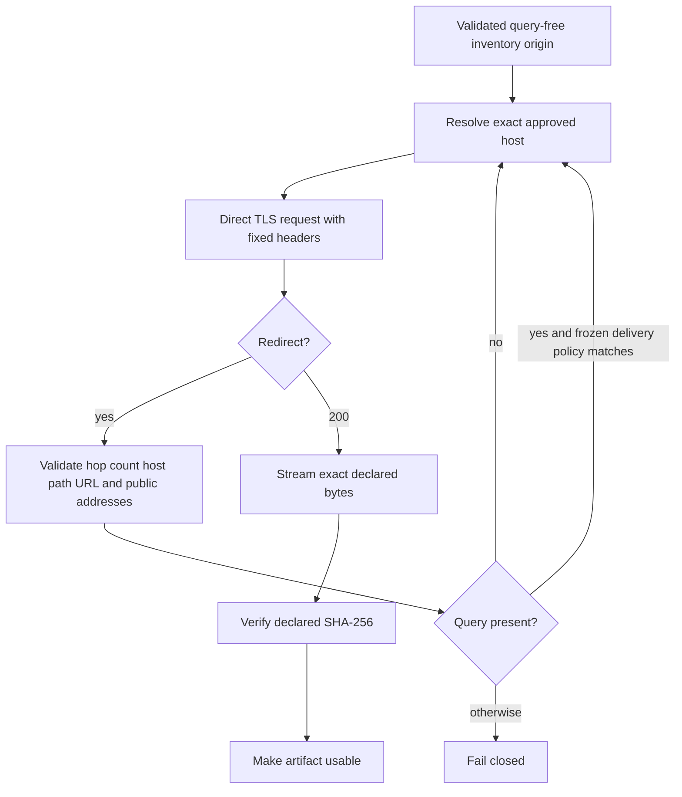
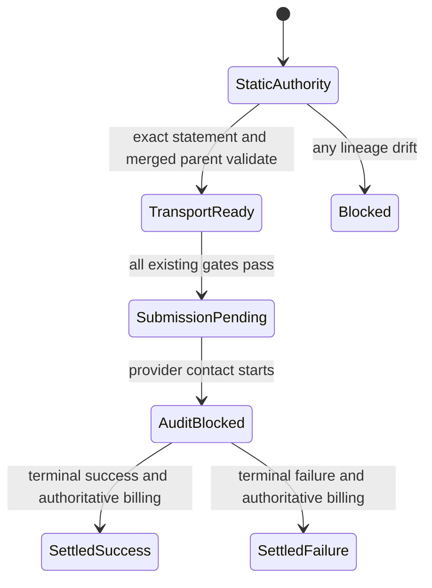

# Signed CDN Transport Amendment - Plan

## Goal Capsule

- **Objective:** The one-shot reference workflow can retrieve exact immutable public artifacts through provider-generated signed redirects without exposing redirect credentials or broadening network authority.
- **Means:** Add a mechanically bound, fail-closed signed-redirect exception inside the existing staged executor (KTD1, KTD2).
- **Authority:** The Product Contract, `PLAN.md`, the existing authority chain, then this implementation plan. A conflict stops before provider contact.
- **Execution profile:** Implement and verify on a feature branch. Merge only after all required checks pass. Regenerate U8 evidence from merged `main` and submit only if every deterministic gate passes.
- **Stop conditions:** Stop before submission on any unknown or mismatched state. A submitted or ambiguous U8 attempt consumes the one-shot slot and remains audit-blocked pending authoritative billing.
- **Tail ownership:** The autonomous pipeline owns implementation, review, public PR maintenance, merge, one-shot U8 execution, and billing settlement within the approved limits. U9 remains proposal-only.

---

## Product Contract

### Summary

Permit provider-generated query parameters only after a query-free immutable public origin redirects to a frozen, path-scoped public delivery endpoint. Keep signed values transient and keep all evidence sanitized.

### Problem Frame

The current executor rejects every query string. Public immutable artifact origins can redirect to provider delivery endpoints that require transient signed query parameters, so the authorized reference action cannot start even though its immutable inventory and privacy gates pass.

### Requirements

**Authority and scope**

- R1. The amendment must be bound to its exact statement bytes, parent authority chain, and merged commit before U8 can be submitted.
- R2. The tracked repository must remain target-neutral, and target-specific inputs must remain ignored local artifacts.
- R3. The amendment must not add an action, retry, fallback, reservation, budget, credential, mount, volume, schedule, persistent store, destructive cleanup, training, conversion, promotion, or threshold approval.

**Transport boundary**

- R4. Every declared artifact origin must remain HTTPS-only, query-free, fragment-free, revision-pinned, host-approved, and bound to exact size and SHA-256.
- R5. A redirect may carry a query only when the destination matches a frozen host and path policy in reviewed code and is also in the request's approved host set.
- R6. Each redirect target must reject user information, fragments, nonstandard ports, unapproved hosts, non-global resolution, and connected-peer drift, with at most five redirects.
- R7. The direct transport must disable ambient proxies and must send no cookies, caller headers, credentials, or authorization material.
- R8. A signed query may exist only in transient remote request-processing memory: the received redirect location, its parsed validated representation, and the immediate outbound request target. It must never appear in logs, errors, receipts, manifests, database rows, persisted artifacts, returned evidence, or a later artifact request.

**Integrity and execution**

- R9. Downloaded bytes must match the inventory entry's declared length and SHA-256 before any artifact becomes usable.
- R10. Any redirect, identity, size, hash, timeout, privacy, or provenance deviation must stop fail-closed without retry.
- R11. The existing one-shot U8 envelope remains one A100-80GB, one concurrent container, one spawn, 2,700 seconds, USD 4.00 incremental, and USD 4.00270969 cumulative including settled smoke spend.
- R12. Configured 262,144-token context must remain distinct from empirically proven-useful context.

### Key Decisions

- **Path-scoped closed allowlist:** Permit query-bearing redirects only through exact provider delivery hosts and path prefixes reviewed in code. (session-settled: user-directed — chosen over rejecting all query strings: immutable public artifacts require provider-generated signed redirects.) Governs R5, R6, R8.
- **No redirect credential persistence:** Treat the complete query as ephemeral bearer-like material. (session-settled: user-directed — chosen over recording redirect URLs for diagnostics: persistence would violate the privacy boundary.) Governs R7, R8.
- **Existing one-shot authority remains controlling:** The amendment changes transport only. (session-settled: user-directed — chosen over issuing a new provider action: the existing U8 slot and caps remain unchanged.) Governs R1, R3, R10, R11.

### Acceptance Examples

- AE1. Covers R4, R5, R6. Given a query-free approved origin that redirects to a frozen delivery path with a query, the executor validates every hop and performs the final GET.
- AE2. Covers R5, R6, R10. Given a query-bearing origin or a query-bearing redirect to any non-frozen host or path, the executor stops before connecting to that target.
- AE3. Covers R7, R8. Given a signed redirect containing a synthetic query sentinel assembled at test runtime, neither successful nor failed serialized evidence contains the complete sentinel.
- AE4. Covers R9, R10. Given incorrect content length, excess bytes, truncated bytes, or a hash mismatch, the artifact is never passed to the loader and no retry occurs.

### Scope Boundaries

#### Deferred to Follow-Up Work

- U9 numeric threshold compilation remains proposal-only after a successful, settled reference result.

#### Outside This Product's Identity

- Generic authenticated downloads, wildcard CDN policies, caller-defined headers, reusable signed URLs, local weight transfer, and any candidate conversion or training.

### Product Contract Preservation

Product Contract unchanged from `docs/plans/2026-08-26-0710-brainstorm-signed-cdn-transport-plan.md`.

---

## Planning Contract

### Key Technical Decisions

- KTD1. **Bind a third, narrow authority layer.** Freeze the exact statement digest and parent merge commit in `constants.py`; validate canonical ignored local authority bytes in `reference_authority.py`; require its hash in the bootstrap request authority binding. (session-settled: user-directed — chosen over treating the approval as prose-only: the paid path must enforce the amendment mechanically.) Governs R1, R3.
- KTD2. **Classify URLs by transition role.** Origin validation always rejects queries. Redirect validation permits a query only for the exact policy below, while every host must also appear in the request's closed approved-host set. Match against the parsed raw path after rejecting control characters, backslashes, invalid percent encodings, literal or percent-encoded dot segments, and percent-encoded separators. Require a complete prefix segment boundary. (session-settled: user-directed — chosen over a general query allowance: only provider-generated delivery redirects are authorized.) Governs R4, R5, R6, R8.
- KTD3. **Keep the query inside the transport call.** Build the HTTP request target from path plus query only at the final direct request boundary. Return and persist only existing sanitized status, peer, length, metrics, and fixed failure codes. (session-settled: user-directed — chosen over persisting final URLs: signed values must remain transient.) Governs R7, R8.
- KTD4. **Preserve integrity as the usability gate.** Keep the existing exact byte-count and streaming SHA-256 checks before model loading. No redirect behavior may bypass them. Governs R9, R10.

| Query-bearing redirect host | Required raw-path prefix | Policy provenance |
|---|---|---|
| `huggingface.co` | `/api/resolve-cache/models/` | Provider-documented download-redirect host plus immutable local metadata-only redirect evidence. |
| `us.aws.cdn.hf.co` | `/xet-bridge-us/` | Provider-documented public CDN edge plus immutable local metadata-only redirect evidence. |

The code constant must equal this table exactly. No other host, path, suffix rule, wildcard, or caller extension is authorized.

### High-Level Technical Design

### Assumptions

- The frozen delivery-host list uses only the exact entries in KTD2, not wildcard suffixes.
- The provider's same-host cache redirect is allowed only under its exact cache path prefix and only after a query-free origin transition.
- Existing generic failure codes are sufficient diagnostics; signed redirect URLs are never needed for public or local evidence.
- A no-body local topology observation completed within 15 minutes of submission is a freshness guard, not proof of the Modal worker's regional route. A remote route outside KTD2 remains an accepted fail-closed one-shot risk under the approved residual provider-risk statement.

### Risks and Mitigations

- **Provider host drift:** Exact allowlists may block future delivery hosts. Fail closed and require a later reviewed amendment rather than accepting wildcards.
- **Local-versus-remote topology drift:** A fresh local observation can differ from the worker's route and consume the one-shot slot after submission. Require a no-body, no-query-persistence observation within 15 minutes before submission, bind only its sanitized host/path-policy match and timestamp into ignored preflight evidence, and retain remote fail-closed validation as the authority.
- **Accidental query disclosure:** Exception text or debug output could retain the URL. Construct a complete synthetic sentinel only at test runtime, keep URL values out of receipts and exceptions, and scan serialized outputs plus generated artifacts for that complete sentinel. Publication scans reject captured provider query material; tracked synthetic fragments are not treated as credentials.
- **Request-target truncation:** Sending only the path would discard the provider signature. Add a focused backend test proving path-plus-query is sent without custom headers.
- **Authority bypass:** Updating transport alone could leave the paid adapter unaware of the amendment. Bind the amendment digest into the bootstrap request and fresh deterministic reproduction.

### Sources and Research

- `src/lowbit_lab/reference_execution.py` owns redirect, DNS, peer, deadline, length, and hash enforcement.
- `src/lowbit_lab/reference_backend.py` owns the direct TLS request and fixed header surface.
- `src/lowbit_lab/reference_bootstrap.py` owns query-free origin validation and the closed request schema.
- `src/lowbit_lab/reference_authority.py` and `src/lowbit_lab/constants.py` provide the existing layered authority pattern.
- `docs/solutions/best-practices/fail-closed-research-control-plane.md` records why signed redirects must not be silently special-cased.
- Hugging Face Hub documentation identifies separate HTTPS redirect and CDN hosts, including exact regional CDN endpoints.
- Python 3.12 `http.client` documentation confirms the request target is the supplied URL selector, so the direct backend must include the validated query.

---

## Implementation Units

### U1. Bind the signed-CDN authority

- **Goal:** Make the exact transport amendment a required child of the existing bootstrap authority.
- **Requirements:** R1, R2, R3, KTD1.
- **Dependencies:** None.
- **Files:** `src/lowbit_lab/constants.py`, `src/lowbit_lab/reference_authority.py`, `src/lowbit_lab/reference_bootstrap.py`, `src/lowbit_lab/reference_modal_adapter.py`, `tests/test_reference_authority.py`, `tests/test_reference_bootstrap.py`, `tests/test_reference_modal_adapter.py`.
- **Approach:** Add fixed statement, authority, parent, and merge identities. Validate one canonical ignored local authority object. Extend the closed bootstrap authority binding so fresh deterministic reproduction and the serialized remote contract cannot omit this layer.
- **Execution note:** Write drift and omission tests before enabling the accepted authority path.
- **Patterns to follow:** Existing parent and bootstrap authority validators and their canonical-byte tests.
- **Test scenarios:**
  - Exact statement, canonical authority, parent hashes, and bound merge commit validate.
  - Statement newline, authority field, parent hash, or path drift fails before capability creation.
  - A bootstrap request missing or changing the transport binding is rejected.
  - The extension changes no resource, budget, retry, action, or privacy field.
- **Verification:** The paid adapter cannot build a remote contract without the exact amendment chain.

### U2. Enforce role-aware signed redirect validation

- **Goal:** Permit only frozen query-bearing delivery redirects while preserving every existing URL and network rejection.
- **Requirements:** R4, R5, R6, R8, R10, KTD2.
- **Dependencies:** U1.
- **Files:** `src/lowbit_lab/reference_execution.py`, `tests/test_reference_execution.py`.
- **Approach:** Split origin and redirect validation roles. Implement the exact KTD2 host-to-path policy. Reject ambiguous raw paths before a segment-boundary prefix comparison. Require request-level host approval in addition to the frozen code policy. Revalidate DNS and peer identity on every accepted hop and retain the five-hop limit.
- **Execution note:** Start with characterization tests for the current rejection matrix, then add only the authorized positive cases.
- **Patterns to follow:** `_validate_url`, `_open_final`, `_public_address`, and existing redirect tests.
- **Test scenarios:**
  - Covers AE1. A query-free approved origin redirects to each frozen host/path policy and succeeds.
  - Covers AE2. A query-bearing origin fails before the first fetch.
  - Covers AE2. Query-bearing redirects to an unapproved host, frozen host with wrong path, fragment, user information, HTTP, or nonstandard port fail before the target fetch.
  - Dot segments, backslashes, control characters, invalid percent encodings, encoded separators, encoded dot segments, and prefix-boundary lookalikes fail before the target fetch.
  - Relative redirects cannot smuggle a query onto an unapproved path.
  - Six redirects fail; five redirects remain the maximum accepted chain.
  - Private, reserved, or peer-drift addresses remain rejected on a signed hop.
- **Verification:** Focused executor tests prove the exception is transition-specific and narrower than the request's approved-host set.

### U3. Preserve transient query handling in the direct backend

- **Goal:** Send the validated signed query without allowing it into any durable or caller-controlled surface.
- **Requirements:** R7, R8, R9, R10, KTD3, KTD4.
- **Dependencies:** U2.
- **Files:** `src/lowbit_lab/reference_backend.py`, `tests/test_reference_backend.py`, `tests/test_reference_execution.py`.
- **Approach:** Construct the direct HTTP selector from the parsed path and query. Keep the fixed `Accept-Encoding: identity` header and direct pinned TLS connection. Assemble a complete synthetic query sentinel from non-secret fragments only at test runtime, then scan success and failure receipts, manifests, exceptions, and generated fixtures for that complete value.
- **Test scenarios:**
  - The backend sends the exact validated path-plus-query selector and no authorization, cookie, or caller header.
  - Covers AE3. The complete runtime-assembled query sentinel is absent from all receipt, manifest, error, and evidence bytes after success and failure.
  - Covers AE4. Length, truncation, excess, and SHA-256 failures still prevent loader access.
  - Ambient proxy variables stop before DNS or fetch.
- **Verification:** Tests prove the query reaches only the outbound request boundary and integrity remains the sole usability gate.

### U4. Regenerate evidence and document the gated operation

- **Goal:** Make the merged-main U8 regeneration and settlement path reproducible without broadening authority.
- **Requirements:** R2, R3, R11, R12.
- **Dependencies:** U1, U2, U3.
- **Files:** `docs/runbooks/reference-approval.md`, `reports/phase1-reference-control-review.md`, `docs/solutions/best-practices/fail-closed-research-control-plane.md`, focused publication tests as needed.
- **Approach:** Document the signed-redirect boundary, exact authority lineage, merged-main regeneration, WSL watchdog requirement, one-shot consumption, and billing settlement. Require a no-body topology observation within 15 minutes before submission and persist only its sanitized policy-match result and timestamp in ignored evidence. Keep target-specific generated contracts and evidence ignored.
- **Test scenarios:**
  - Publication and privacy scans reject target identity and captured provider query material in tracked files; generated artifacts reject the complete runtime-assembled sentinel.
  - Dry-run regeneration reports configured context as 262,144 and proven-useful context as unknown.
  - A stale, body-reading, query-persisting, or policy-mismatched topology observation prevents submission; the evidence never claims remote-route fidelity.
  - A dirty tree, unmerged commit, stale authority, occupied slot, or unsettled budget prevents submission.
- **Verification:** The final approval packet is reproducible from merged `main`, and the paid command has no retry or fallback path.

---

## Verification Contract

| Gate | Command | Required outcome |
|---|---|---|
| Authority and bootstrap | `python -m pytest tests/test_reference_authority.py tests/test_reference_bootstrap.py -q` | Exact amendment chain and request binding pass; all drift cases fail closed. |
| Transport and backend | `python -m pytest tests/test_reference_execution.py tests/test_reference_backend.py -q` | Signed redirects pass only within the frozen policy; queries never enter evidence. |
| Paid adapter boundary | `python -m pytest tests/test_reference_modal_adapter.py tests/test_modal_job.py -q` | No omission, retry, fallback, or resource-envelope bypass exists. |
| Full regression | `python -m pytest -q` | Entire suite passes. |
| Lint | `python -m ruff check .` | No lint findings. |
| Public privacy | Existing publication/privacy scan command in `docs/runbooks/reference-approval.md` | No target-specific or signed-query material is tracked. |
| Pre-submit | Existing U8 dry-run/preflight command in `docs/runbooks/reference-approval.md` from merged `main` under WSL | All deterministic gates pass; no provider contact or weight transfer occurs. |

---

## Definition of Done

- U1-U4 satisfy their test scenarios and verification outcomes.
- The authority statement digest, canonical authority hash, plan hash, merge commit, bootstrap request hash, action contract hash, and execution scope hash are traceable.
- The frozen redirect policy contains exact hosts and path prefixes only; no wildcard or caller extension exists.
- Signed query values are absent from tracked and generated evidence.
- Focused and full tests, lint, and publication/privacy scans pass.
- Simplification removes duplicate validators and unnecessary abstractions.
- Review covers reproducibility, Modal-credit safety, local GPU compatibility, security/private-data handling, and research-loop support; clear high-confidence findings are fixed.
- Durable lessons are added to `docs/solutions/` without target-specific details.
- The public PR passes required checks and is merged before U8 regeneration.
- U8 is executed at most once only when every merged-main gate passes, then remains audit-blocked until authoritative billing settles it.
- Actual spend and configured-versus-proven 262,144-token context are reported separately.
- No abandoned experimental code remains in the diff.
