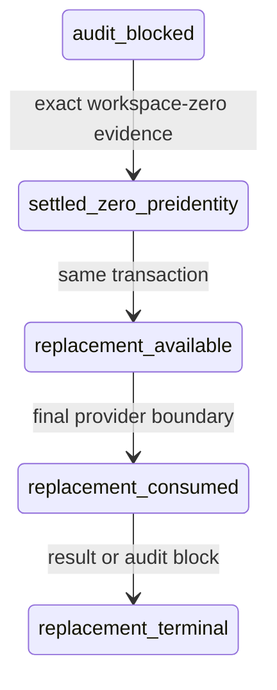

# Fix pre-identity U8 settlement

## Summary

Add a narrow zero-cost settlement contract for the existing authentication failure that occurred
before Modal issued any provider identity, then mint one independent replacement entitlement under
the user's approved bounded authority.

## Problem Frame

The original slot is correctly consumed and its reservation is audit-blocked, but schema v12 can
settle only identity-attributed billing. Modal's authenticated workspace billing API now reports no
usage, yet the database cannot record that truth without fabricating a provider ID. The fix must add
an honest pre-identity mode without weakening normal settlement.

## Requirements

Implement R1-R10 from the requirements-only origin without broadening them.

## Key Technical Decisions

- KTD1 (session-settled, user-approved): use a separate workspace-zero receipt and settlement mode;
  reject reusing the identity-attributed billing schema. Rejected: sentinel app/call identity.
- KTD2 (session-settled, user-approved): preserve the original consumed slot and create one child
  replacement entitlement only inside the successful zero-settlement transaction. Rejected: reset.
- KTD3: accept workspace aggregate evidence only when exact total cost is zero and the result is
  complete and unfiltered. Any nonzero result cannot be attributed safely and remains blocked.
- KTD4: keep authority shape target-neutral in Git; bind live reservation, scope, workspace, and report
  bytes only in ignored local artifacts.

## High-Level Technical Design

There is no transition back to the original slot and no edge from replacement-consumed to available.

## Implementation Units

### U1. Closed authority and evidence contracts

**Goal:** Encode the exact human grant, authenticated workspace receipt, report-byte manifest, complete
interval rules, and zero-only semantics as closed target-neutral contracts.

**Requirements:** R1-R4, R8-R9.

**Dependencies:** None.

**Files:** `src/lowbit_lab/constants.py`, `src/lowbit_lab/reference_authority.py`,
`src/lowbit_lab/reference_gates.py`, `src/lowbit_lab/reference_settlement.py`,
`tests/test_reference_authority.py`, `tests/test_reference_gates.py`,
`tests/test_reference_settlement.py`.

**Approach:** Read evidence bytes once, validate and hash that snapshot, bind provider/workspace scope,
reservation, execution scope, failure class, interval, acquisition time, completeness, row count, exact
zero cost, raw byte length and digest. The WSL-only Modal CLI empty report is the exact byte sequence
`[]` followed by LF; it is persisted without normalization. Never persist credential values or
workspace display names.

**Test scenarios:** exact empty report succeeds; nonzero, filtered, partial, backdated, future, altered,
wrong-workspace, wrong-scope, wrong-reservation, rounded-zero, or incomplete evidence fails closed.

**Verification:** Closed contracts reproduce the approved grant and official full-interval semantics.

### U2. Atomic schema-v13 settlement and replacement entitlement

**Goal:** Settle the unique identity-less AuthError row at USD 0 and create exactly one replacement slot
without modifying the original slot.

**Requirements:** R1-R5, R7, R9.

**Dependencies:** U1.

**Files:** `src/lowbit_lab/db.py`, `tests/test_db.py`.

**Approach:** Transactionally migrate with explicit mutually exclusive invariants for normal identity
settlement versus workspace-zero pre-identity settlement. In one `BEGIN IMMEDIATE`, compare-and-set the
eligible row, terminalize its experiment as failed with actual USD 0, record immutable evidence lineage,
and insert one available replacement entitlement. Consume that entitlement with the replacement
reservation at the final boundary.

**Test scenarios:** migration preserves history; exact live-shape settlement succeeds; sentinel identity
fails; duplicate/replay/race produces one winner; rollback creates neither half-settlement nor slot;
original slot stays consumed; replacement cannot be consumed twice; lifetime accounting remains exact.

**Verification:** Disposable production-shaped database reproduction and focused concurrency tests pass.

### U3. Settlement, status, authentication, and replacement orchestration

**Goal:** Provide small JSON CLIs that capture sanitized authenticated workspace evidence, persist exact
billing bytes locally, settle without provider execution, and gate the replacement through fresh evidence.

**Requirements:** R2-R10.

**Dependencies:** U1, U2.

**Files:** `src/lowbit_lab/reference_orchestrator.py`, `src/lowbit_lab/reference_bootstrap.py`,
`src/lowbit_lab/reference_modal_adapter.py`, `tests/test_reference_orchestrator.py`,
`tests/test_reference_bootstrap.py`, `tests/test_reference_modal_adapter.py`.

**Approach:** Add read-only evidence/status and local settlement commands that never import submission
primitives. Replacement prepare/execute regenerates every prior gate, cross-binds workspace auth to the
settlement, and consumes the child entitlement at the existing final boundary. Provider-facing code keeps
one spawn, no retries, no mounts/volumes/secrets, and the existing deadline.

**Test scenarios:** missing/stale/wrong auth blocks before reservation; status is read-only; settlement
cannot submit; replacement starts only after settlement; every post-boundary failure consumes it; a local
pre-boundary failure cannot falsely report provider contact.

**Verification:** Focused CLI tests prove zero-spend separation and the existing remote adapter envelope.

### U4. Runbooks, review, and durable learning

**Goal:** Make recovery reproducible and auditable without publishing local identities.

**Requirements:** R8-R10.

**Dependencies:** U1-U3.

**Files:** `BUDGET.md`, `docs/runbooks/reference-approval.md`,
`reports/phase1-reference-control-review.md`,
`docs/solutions/best-practices/fail-closed-research-control-plane.md`.

**Approach:** Document the narrow mode, exact stop conditions, one replacement limit, billing residual
risk, and configured-versus-proven context distinction. Run reproducibility, budget, hardware, privacy,
and research-loop reviews; fix only clear high-confidence findings.

**Test scenarios:** publication scan finds no target/workspace/profile/report data; documentation claims
match code and tests.

**Verification:** Full tests, lint, privacy/publication scans, doc validation, and independent review pass.

## Verification Contract

- Focused database, authority, settlement, orchestrator, bootstrap, and adapter tests pass.
- Full test suite and Ruff pass in the locked environment.
- Publication/privacy scan reports zero findings.
- Disposable copies prove migration, exact-zero settlement, budget release, and single replacement.
- The authoritative database is mutated only after merged-main code reproduces exact evidence.

## Definition of Done

- Existing audit-blocked attempt is authoritatively settled at USD 0 without invented identity.
- Original U8 slot remains consumed; exactly one replacement entitlement exists and is mechanically bound.
- Public PR is reviewed, green, and merged before live settlement or replacement execution.
- Replacement U8 runs at most once under the unchanged envelope and is authoritatively settled afterward.
- Proven-useful context remains unknown unless returned evaluation evidence actually demonstrates it.

## Sources & Research

- `docs/solutions/best-practices/fail-closed-research-control-plane.md`
- Modal official billing CLI and Workspace billing API documentation: hourly reports include only full
  intervals and attribute costs by object; empty complete unfiltered workspace results represent no usage.
