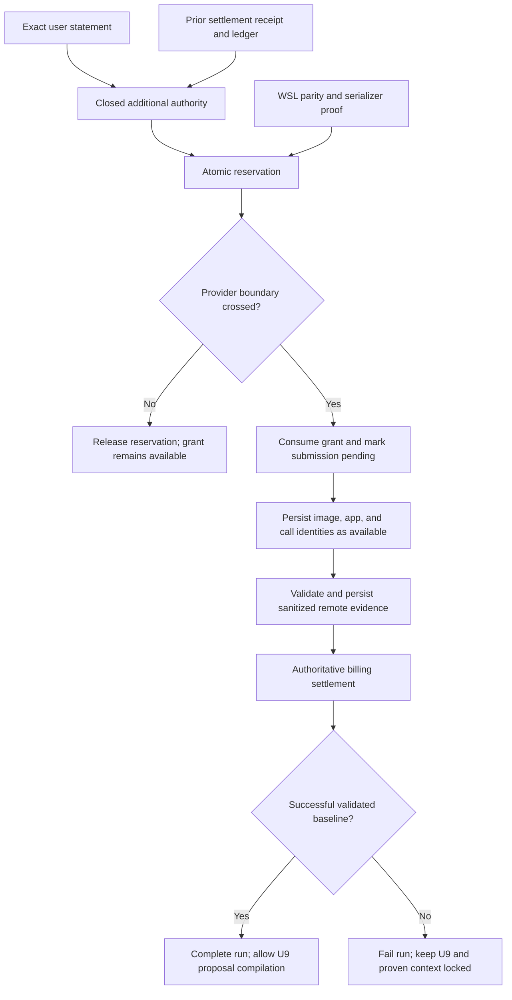
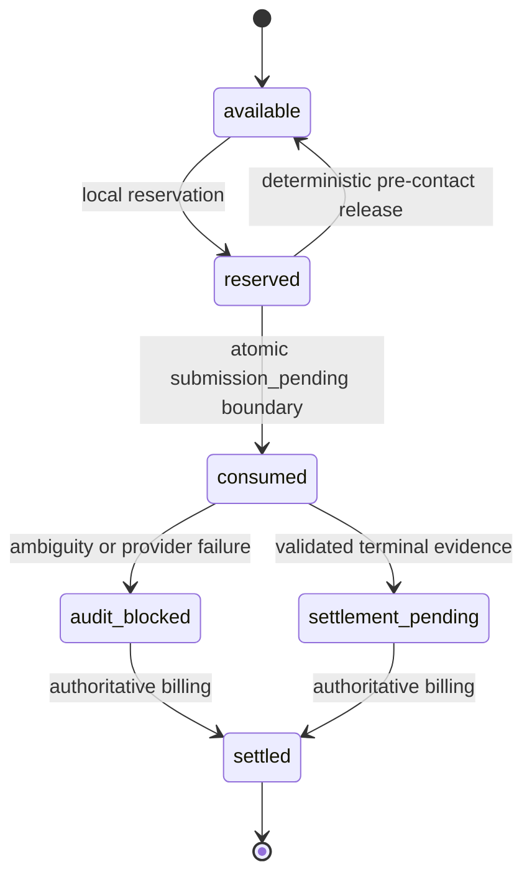

# Additional U8 Reference Authority - Plan

## Goal Capsule

- **Objective:** Execute and authoritatively settle one reproducible Phase 1 reference-baseline attempt, producing the baseline only if the authorized one-shot action succeeds, without reopening either consumed historical authority.
- **Means:** Add a separately versioned, append-only authority generation; make the audited Modal callable deployable; bind the exact grant through reservation, execution, settlement, and evidence.
- **Authority:** The user-approved statement is bound to merge `c90368d205f083f58a647f3134f70c033ce8703c`, settlement receipt `f3bd5f4c64b9c725be3c0682d908f7064438d65341fa97b4072ad516b7031555`, USD 0.00564445 prior spend, USD 4.00 incremental cap, and USD 4.00564445 lifetime cap.
- **Execution profile:** One A100-80GB, one container, one spawn, 2,700 seconds, zero retries, no fallback GPU, and no overlapping reservation.
- **Stop conditions:** Any lineage, privacy, serialization, WSL parity, authentication, topology, budget, watchdog, provider-state, or settlement ambiguity fails closed. A crossed provider boundary consumes the grant permanently.

---

## Product Contract

### Summary

The lab needs a third and final U8 action class that preserves the original slot and the first replacement as immutable consumed history. Standing authority removes repeated human approvals; it does not weaken one-shot consumption, the paid boundary, or settlement requirements.

### Problem Frame

The existing original U8 slot and replacement entitlement are consumed, and the replacement is settled as failed. Existing code also cannot deploy its current 260,033-byte serialized callable under Modal's frozen 65,536-byte function limit. Reusing historical authority, changing old canonical authority values, or discovering serialization failure after reservation would violate lineage and one-shot safety.

### Requirements

**Authority and lineage**

- R1. Record a new exact authority generation bound to the raw user statement, base merge, settled replacement receipt bytes, the settled replacement receipt's `execution_scope_sha256`, and initial settled spend.
- R2. Preserve the original authority slot, replacement entitlement, their settlements, and all historical authority constants without reset or reinterpretation.
- R3. Carry the new authority identity through the canonical request, packet, challenge, capability, reservation, provider boundary, evidence, status, and settlement.

**Budget and concurrency**

- R4. Require authoritative committed cost to equal USD 0.00564445 before reserving exactly USD 4.00 under the USD 4.00564445 lifetime ceiling.
- R5. Reject overlapping, audit-blocked, or previously consumed additional reservations and permit at most one available-to-consumed transition.

**Pre-provider readiness**

- R6. Admit only Modal's exact pinned hydration bytes at or below 65,536 bytes, proven twice before reservation and bound unchanged at hydration; the production payload must remain below that ceiling.
- R7. Execute only from the ext4-backed WSL mirror after exact parity with the durable Windows state, clean merged `main`, database integrity, fresh authentication, fresh topology, runtime lineage, and watchdog checks.
- R8. Preserve the one-A100, one-container, one-spawn, 2,700-second, zero-retry, zero-fallback resource envelope.

**Execution, settlement, and evaluation**

- R9. Define the paid provider boundary as entry into the Modal app context or invocation of any remote submission primitive. Local pinned-SDK import, read-only authentication, topology inspection, serialization, and hydration validation occur before that boundary. Consume the additional authority atomically with `submission_pending` immediately before crossing it; deterministic pre-boundary failure may release only the reservation and must leave the grant available.
- R10. Persist reservation-specific authority identity plus every provider identity as soon as each exists; post-boundary uncertainty remains audit-blocked.
- R11. Support authoritative settlement for call-attributed, app-attributed, billing-only retention, and exact workspace-zero pre-identity outcomes without minting another action.
- R12. Decide experiment success independently from billing success: only a validated successful remote receipt that satisfies every locked evaluation-completeness invariant plus authoritative within-cap settlement may complete the run. Scientific adequacy and numeric promotion thresholds remain proposal-only under R14.
- R13. Keep 262,144 tokens configured but unproven until the locked evaluation evidence empirically proves usefulness.
- R14. Unlock only zero-spend U9 proposal compilation after a successful settled baseline; numeric approval, candidate execution, conversion, training, and promotion remain unavailable.

**Privacy and publication**

- R15. Retrieve only revision-pinned immutable public artifacts inside the isolated worker and return only sanitized evidence.
- R16. Forbid local weights, private or user payloads, worker secrets, mounts, volumes, persistent storage, schedules, destructive cleanup, source uploads, and opaque executable source bundles.
- R17. Keep tracked public artifacts target-neutral and keep target, provider identity, credentials, and machine-specific paths confined to ignored local evidence.
- R18. Immediately before provider submission and before and after every billing capture, generate a sanitized provider-authentication receipt that verifies the frozen official endpoint, authenticated workspace identity, pinned SDK identity, and absence of ambient proxies, custom TLS, import-path overrides, provider-prefixed environment overrides, and caller-supplied headers. Bind its exact bytes to the authority, reservation, execution scope, and billing evidence without reading or recording credential values.
- R19. Before WSL becomes the paid-action state owner, persist an immutable Windows-side transfer marker bound to the WSL mirror and imported database hash. While active, it forbids a new import or preparation; it clears only after terminal WSL state is reconciled back and the Windows destination hash is verified.

### Acceptance Examples

- AE1. Given the exact settled ledger and an available new grant, when two processes race to reserve, exactly one reservation succeeds and neither historical authority row changes. Covers R1-R5.
- AE2. Given serialized hydration bytes of 65,536 bytes, admission succeeds; at 65,537 bytes it fails before reservation. The production payload also stays below the provider ceiling with the repository absent from `sys.path`. Covers R6 and R16.
- AE3. Given a deterministic failure before `submission_pending`, the reservation and run terminate locally while the new grant remains available. Covers R9.
- AE4. Given any exception after `submission_pending`, the grant remains consumed and the reservation stays audit-blocked until authoritative billing settles it. Covers R9-R12.
- AE5. Given a successful validated receipt and within-cap billing, the experiment completes and U9 may compile a proposal; every partial or failed receipt leaves proven-useful context unset and U9 locked. Covers R12-R14.
- AE6. Given an active Windows-to-WSL ownership marker, a second import or preparation fails; only a hash-verified terminal reconciliation clears the marker. Covers R7, R10, and R19.

### Scope Boundaries

**Included**

- A new append-only authority generation and schema migration.
- Deployable audited remote serialization without mounts or source upload.
- Reservation-specific provider-boundary lineage, lifecycle completion, settlement coverage, WSL parity, tests, runbooks, and one authorized execution.

**Deferred to Follow-Up Work**

- Human review and approval of U9 numeric threshold proposals.

**Outside this product's identity**

- Candidate conversion, low-bit training, promotion, additional provider actions, retries, persistent infrastructure, scheduling, and private-data workflows.

---

## Planning Contract

### Key Technical Decisions

- KTD1. **Append a new authority generation.** (session-settled: user-approved — chosen over stopping after the consumed replacement: one further bounded action is needed to establish the Phase 1 baseline.) A new singleton grant owns R1-R5 and never updates the consumed historical slots.
- KTD2. **Version budget facts by action generation.** (session-settled: user-approved — chosen over retaining the old USD 4.00270969 lifetime cap: the settled USD 0.00293476 replacement cost must remain counted.) Historical constants stay immutable; the new path owns USD 0.00564445 prior spend and USD 4.00564445 lifetime spend under R4.
- KTD3. **Consume authority only at the reservation-specific provider boundary.** The reservation stores the new grant identity, and every later transition verifies that exact grant-reservation pair rather than relying only on the shared execution-scope digest. Governs R5, R9, and R10.
- KTD4. **Build a minimal audited worker module.** Reduce by-value serialization by isolating only required remote runtime functions and importing pinned third-party packages normally. Do not compress and execute source text or enable implicit source inclusion. Governs R6, R15, and R16.
- KTD5. **Make WSL the sole paid execution context.** The Windows checkout remains durable shared state; a hash-bound ownership-transfer marker and parity receipt control Windows-to-WSL import, prohibit split-brain preparation while WSL owns unsettled state, and control WSL-to-Windows return. Governs R7, R17, and R19.
- KTD6. **Separate execution outcome from billing outcome.** Billing settlement records cost, while the validated remote receipt determines completed versus failed. No settlement path restores authority. Governs R10-R14.

### High-Level Technical Design

### Assumptions

- The ext4 WSL mirror remains the only environment capable of reproducing the historical ignored config and request bytes without newline translation.
- The production callable can be reduced below 65,536 bytes without broadening remote source or data transfer; failure to prove this blocks execution but does not invalidate the authority design.
- Modal billing remains authoritative only after the configured completeness delay.

### Dependencies and Sequencing

Authority and schema work precede every consumer. Serialization and lifecycle support must merge before ignored evidence is regenerated. The WSL mirror then imports the reviewed merged commit and exact durable state, proves all local gates twice, and only afterward may reserve and consume the single action.

---

## Implementation Units

### U1. Freeze and validate the additional authority

- **Goal:** Create a closed ignored authority artifact whose exact identity is independently frozen in tracked code.
- **Requirements:** R1-R4, R8, R14-R18; KTD1-KTD2.
- **Dependencies:** None.
- **Files:** `src/lowbit_lab/constants.py`, `src/lowbit_lab/reference_authority.py`, `tests/test_reference_authority.py`, `configs/local/` ignored authority files.
- **Approach:** Preserve every historical authority builder and constant. Add an additional-action builder and validator that binds exact statement framing, base commit, settled receipt bytes, the receipt's exact `execution_scope_sha256`, prior cost, caps, resource envelope, forbidden capabilities, and proposal-only U9.
- **Execution note:** Start with exact-byte and drift tests before materializing the ignored authority.
- **Patterns to follow:** Existing recovery and workspace-reconciliation authority validators; raw-byte lineage guidance in `docs/solutions/best-practices/fail-closed-research-control-plane.md`.
- **Test scenarios:**
  - Exact statement bytes and canonical authority validate to the frozen digests.
  - BOM, newline, base-commit, receipt, prior-execution-scope, cost, cap, resource, or forbidden-field drift fails.
  - Existing historical authorities continue reproducing their original digests.
- **Verification:** The tracked validator accepts exactly one ignored authority value and cannot broaden its action class.

### U2. Add the append-only grant and budget transaction

- **Goal:** Represent and reserve the final one-shot action without mutating consumed history.
- **Requirements:** R1-R5, R9-R10; KTD1-KTD3.
- **Dependencies:** U1.
- **Files:** `src/lowbit_lab/db.py`, `tests/test_db.py`.
- **Approach:** Add schema v15 with a singleton additional-authority table and reservation-specific grant binding. Fingerprint the complete v14 schema before migration, preserve every existing cell, reproduce exact historical costs, exclude active or audit-blocked overlaps, reserve USD 4.00 atomically, and consume only through `available -> consumed` at `submission_pending`.
- **Execution note:** Characterize the populated v14 database and migration rollback before changing reservation logic.
- **Patterns to follow:** Existing schema-fingerprint migrations, `BEGIN IMMEDIATE` reservation setup, compare-and-set transitions, and consumed replacement history.
- **Test scenarios:**
  - A populated v14 database migrates with original slot, replacement entitlement, reservations, costs, and settlement hashes unchanged.
  - Unknown schema objects, mismatched settled receipt rows, or historical cost drift roll back migration or reservation.
  - Two concurrent reservations yield one winner.
  - Deterministic pre-boundary release preserves grant availability; post-boundary ambiguity cannot restore it.
  - A second consumption, overlap, audit-blocked predecessor, requested cost drift, or cumulative-cap breach fails.
- **Verification:** A disposable production-shaped database proves cell preservation and exact USD 0.00564445 plus USD 4.00 accounting.

### U3. Bind the new grant through request, config, and status

- **Goal:** Make every local consumer reproduce the same authority and expose its sanitized state.
- **Requirements:** R3-R8, R13-R17; KTD2-KTD3.
- **Dependencies:** U1-U2.
- **Files:** `src/lowbit_lab/reference_bootstrap.py`, `src/lowbit_lab/reference_contract.py`, `src/lowbit_lab/reference_orchestrator.py`, `src/lowbit_lab/modal_job.py`, `tests/test_reference_bootstrap.py`, `tests/test_reference_orchestrator.py`, `tests/test_modal_job.py`.
- **Approach:** Version the additional request/action schema, packet, challenge, caps, settled-before value, and CLI mode without changing historical validators. Status reports the grant, reservation, execution evidence, billing state, cumulative actual cost, configured context, and proven context without provider identifiers.
- **Test scenarios:**
  - Exact additional request and packet reproduce across config refreshes; any authority or prior-settlement drift fails before provider contact.
  - Old original/replacement request fixtures still validate under their historical schema.
  - Status distinguishes available, reserved, consumed, audit-blocked, settled-success, and settled-failure states without private values.
  - Configured 262,144 never implies proven usefulness.
- **Verification:** Local prepare and dry-run outputs are canonical, target-neutral, and provider-free.

### U4. Reduce and freeze the Modal hydration payload

- **Goal:** Produce an audited deployable function below Modal's frozen byte limit before reservation.
- **Requirements:** R6, R8, R15-R18; KTD4.
- **Dependencies:** U3.
- **Files:** `src/lowbit_lab/reference_remote_runtime.py`, `src/lowbit_lab/reference_modal_adapter.py`, `tests/test_reference_modal_adapter.py`, `tests/test_reference_remote_runtime.py`.
- **Approach:** Extract the minimum worker runtime into a narrow module, register only that module by value, and keep pinned dependencies in the image. Preserve the exact serialized payload object through local admission and SDK hydration. Preserve the existing signed-CDN transport validator and its closed host, redirect, address, header, query-lifetime, byte-length, and digest rules inside the extracted runtime.
- **Execution note:** Use serializer characterization first; the paid path stays unreachable until the production graph passes twice.
- **Test scenarios:**
  - Production serialization is below 65,536 bytes and remains stable across two isolated runs.
  - Exactly 65,536 bytes passes and 65,537 bytes fails before reservation.
  - Round-trip worker execution succeeds with the repository removed from `sys.path`.
  - SDK hydration consumes the identical admitted payload bytes.
  - No source mount, implicit inclusion, secret, local artifact, compressed source bundle, or extra by-value module enters the graph.
  - HTTPS-only query-free origins, the frozen redirect-host allowlist, five-hop limit, global-address resolution, and transient signed queries pass; proxies, cookies, caller headers, credentials, user information, fragments, nonstandard ports, private addresses, and artifact size or SHA-256 drift fail before use.
- **Verification:** The production-sized serializer test and privacy scan pass in the pinned WSL environment.

### U5. Enforce the exact grant at the provider boundary

- **Goal:** Consume the final grant only after every deterministic gate and preserve reservation-specific lineage afterward.
- **Requirements:** R3, R5-R10, R15-R19; KTD3-KTD5.
- **Dependencies:** U2-U4.
- **Files:** `src/lowbit_lab/reference_modal_adapter.py`, `src/lowbit_lab/db.py`, `tests/test_reference_modal_adapter.py`, `tests/test_db.py`.
- **Approach:** Extend the capability with the additional authority and workspace bindings. Immediately before the paid boundary, generate and bind the R18 provider-authentication receipt, validate the cached SDK identity, consume the exact grant with `submission_pending`, and require the grant-reservation pair on provider-prepared, submitted, audit, and settlement transitions.
- **Test scenarios:**
  - Every deterministic failure from serializer admission through boundary authentication occurs before grant consumption.
  - Authority consumption and `submission_pending` are atomic under injected database failures.
  - Image, app, and call identities are recorded at their first availability without entering public output.
  - Exceptions before and after each provider identity produce the correct released or audit-blocked state.
  - Timeout, crash, SDK identity drift, or evidence-write failure after the boundary consumes the grant permanently.
- **Verification:** Read-only pinned-SDK import and deterministic provider checks remain pre-boundary; no code path can enter an app context or invoke a remote submission primitive without a consumed matching grant and durable reservation.

### U6. Complete lifecycle and settlement coverage

- **Goal:** Settle every reachable final-action identity state while preserving failed versus completed experiment truth.
- **Requirements:** R10-R14, R18; KTD6.
- **Dependencies:** U2-U5.
- **Files:** `src/lowbit_lab/db.py`, `src/lowbit_lab/reference_orchestrator.py`, `src/lowbit_lab/reference_replacement_settlement.py`, `tests/test_db.py`, `tests/test_reference_orchestrator.py`, `tests/test_reference_replacement_settlement.py`.
- **Approach:** Reuse factual call, app, and billing-only evidence schemas behind the new grant identity. Add exact workspace-zero pre-identity settlement only for complete zero evidence. Require bound R18 authentication receipts before and after billing capture. Transition the experiment from created through validated and running; after billing, complete only a successful receipt satisfying the locked evaluation-completeness invariants and otherwise fail without changing cost truth or minting authority.
- **Test scenarios:**
  - Successful receipt plus within-cap billing completes the experiment and settles the reservation.
  - Valid fail-closed receipt plus billing fails the experiment while settling cost.
  - Over-cap cost is durably recorded as terminal budget failure.
  - App-only, call-ID, retained-app, expired-app, and no-identity zero-cost paths bind exact evidence.
  - Incomplete, stale, multiple-identity, nonzero-unattributed, mismatched, or replayed evidence fails closed without mutation.
  - No settlement state creates another entitlement or retry.
- **Verification:** The state machine is exhaustive and reservation cost, execution outcome, and U9 eligibility remain separate facts.

### U7. Add WSL parity and recovery-safe state transfer

- **Goal:** Make the reviewed ext4 mirror the only paid execution context while Windows remains durable state.
- **Requirements:** R7, R10, R15-R19; KTD5.
- **Dependencies:** U1-U6.
- **Files:** `src/lowbit_lab/reference_orchestrator.py`, `docs/runbooks/reference-approval.md`, `tests/test_reference_orchestrator.py`.
- **Approach:** Generate a sanitized parity receipt over merged HEAD, tracked tree, database hash and integrity, authority/config/request/runtime/evaluation/provenance identities, provider SDK version, and serialized payload. Before import, create an immutable Windows-side marker naming the exact WSL mirror and database hash; while active, reject every new import or preparation and recover only from the named WSL state. Clear it only after terminal state is returned recoverably and source/destination hashes match.
- **Test scenarios:**
  - Any HEAD, tree, database, authority, config, request, auth, runtime, or serializer mismatch blocks reservation.
  - Native Windows and `/mnt/c` execution are rejected.
  - Interrupted imports preserve the prior durable database and cannot produce a valid parity receipt.
  - A crash after authority consumption leaves the ownership marker active, blocks every new preparation, and requires WSL-to-Windows reconciliation before the marker can clear.
  - Post-settlement return verifies source and destination hashes before replacing durable state.
- **Verification:** A clean dry run proves identical parity receipts and database integrity on both sides without copying credentials or weights.

### U8. Gate U9 proposal compilation and operate the one-shot action

- **Goal:** Prove the complete zero-spend preparation, ship it, then execute and settle the single authorized provider action.
- **Requirements:** R4-R19; KTD1-KTD6.
- **Dependencies:** U1-U7.
- **Files:** `src/lowbit_lab/reference_orchestrator.py`, `docs/runbooks/reference-approval.md`, `docs/solutions/best-practices/`, `tests/test_reference_orchestrator.py`, `tests/test_publication.py`.
- **Approach:** Keep U9 unavailable until the new reservation is authoritatively settled and its validated evidence proves a successful baseline. Run focused/full verification, independent review, publication/privacy checks, and merged-main regeneration before the WSL action. Settle authoritative billing after its completeness delay and synchronize durable evidence back to Windows.
- **Test scenarios:**
  - U9 is unavailable for available, reserved, consumed, audit-blocked, failed, partial, or unsettled actions.
  - Only a successful settled receipt satisfying every locked evaluation-completeness invariant produces a lineage-bound proposal artifact; scientific adequacy and numeric thresholds remain proposal-only.
  - Numeric threshold approval and every candidate/provider execution surface remain absent.
  - Public scans reject target, credentials, provider identifiers, private paths, or local artifact bytes.
- **Verification:** The reviewed merged implementation passes all gates before one provider boundary, then terminates in an authoritatively settled state with exact cumulative spend.

---

## System-Wide Impact

- **Experiment lineage:** Adds one authority generation and reservation identity without rewriting prior rows.
- **Database:** Migrates schema 14 to 15 under full-schema fingerprint and populated-history preservation.
- **Provider safety:** Moves serialization proof earlier and strengthens reservation-specific checks at every post-boundary transition.
- **Operations:** Formalizes Windows/WSL state ownership and recoverable synchronization.
- **Research loop:** Makes successful baseline evidence, billing truth, configured context, proven context, and U9 eligibility mechanically distinct.

---

## Risk Analysis and Mitigation

- **Serialization remains over limit:** Keep reservation and provider contact unreachable until the production payload passes twice.
- **Historical lineage drift:** Preserve old validators/constants and require exact deployed-schema and settlement reproduction.
- **Double spend or overlap:** Use a singleton grant, `BEGIN IMMEDIATE`, exact committed-cost equality, and reservation-specific consumption.
- **Split-brain Windows/WSL state:** Require parity receipts, source-of-truth declaration, recoverable backups, and destination hash verification.
- **Provider ambiguity:** Consume at `submission_pending`, persist identities immediately, audit-block uncertainty, and wait for authoritative billing.
- **False baseline success:** Bind run completion and proven context only to validated successful evaluation evidence plus settled billing.
- **Privacy leakage:** Persist only canonical sanitized receipts and scan tracked paths/content before every push.

---

## Verification Contract

| Surface | Required evidence | Done signal |
|---|---|---|
| Authority | Focused authority and drift tests | Exact statement, base, receipt, budget, and restriction digests reproduce |
| Database | Schema, concurrency, budget, lifecycle, rollback, and settlement tests | Populated v14 history migrates unchanged and one v15 grant consumes once |
| Serialization | Isolated WSL production and boundary tests | Two identical payload hashes, each below 65,536 bytes |
| Control plane | Request, packet, status, parity, CLI, and provider-boundary tests | Every pre-contact failure stays local and every post-boundary state is auditable |
| Full repository | `pytest -q` and Ruff | Full tests pass with only documented skips; lint is clean |
| Publication | Repository publication/privacy scan and `git diff --check` | Zero findings and no whitespace errors |
| Shipping | Public PR checks and independent review | Reviewed merge commit is clean and CI-decided |
| Provider action | Exact WSL parity, request confirmation, one submission, and authoritative billing | One terminal reservation with exact actual and cumulative cost |

---

## Definition of Done

- The new authority is append-only, exact-byte bound, and cannot reset or regenerate historical authority.
- Schema v15 preserves the complete populated v14 history and binds one additional grant to one reservation.
- The production Modal callable is below the provider limit and exact hydration bytes are bound before reservation.
- All local lineage, privacy, budget, WSL parity, authentication, topology, watchdog, lifecycle, and settlement gates pass.
- Focused and full tests, Ruff, publication/privacy scans, simplification, and independent review pass.
- Changes are committed, pushed, reviewed, merged, and reproduced from clean merged `main` in the WSL mirror.
- At most one additional U8 provider boundary is crossed; no retry or fallback exists.
- The action is authoritatively settled, exact cumulative spend is recorded, and Windows durable state matches WSL evidence.
- Configured 262,144-token context remains distinct from proven-useful context.
- U9 is either still locked after failure or produces only a lineage-bound proposal after a successful baseline.
